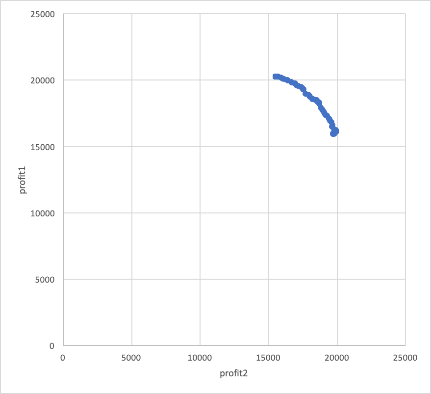

# MOEAD
## 実行の流れ
- `jupyter notebook`
- pythonファイル書きだし `jupyter nbconvert --to python *.ipynb`

## 構成
- `Main` : メイン処理
- `MOEAD` : MOEA/D 本体

## 実行
- 1000世代実行
- 結果ファイル
 - `` 最終世代の各個体のprofitとweight
 - `` 最終世代の各個体の遺伝子

